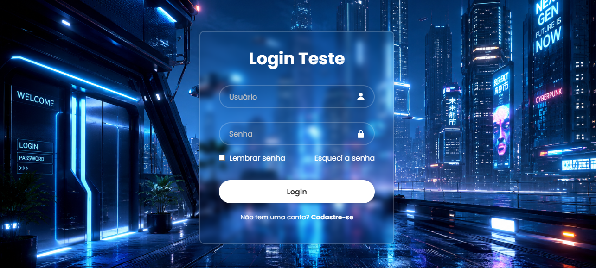

<h1 align="center">🔐 Página de Login Responsiva</h1>

  Projeto desenvolvido utilizando <strong>HTML5</strong> e <strong>CSS3</strong>, 
  com foco em criação de interfaces modernas, responsivas e organizadas.

<h2>📌 Sobre o Projeto</h2>

Esta aplicação consiste em uma interface de login moderna e responsiva, criada para praticar 
estruturação semântica em HTML e estilização com CSS.

O projeto possui um layout limpo e adaptável para diferentes dispositivos, podendo ser utilizado 
como base para sistemas web, dashboards administrativos, portais ou autenticação de usuários.

<h2>🚀 Funcionalidades</h2>

<ul>
  <li>✅ Tela de login moderna</li>
  <li>✅ Layout responsivo</li>
  <li>✅ Estrutura organizada e semântica</li>
  <li>✅ Campos de usuário e senha</li>
  <li>✅ Botão de acesso estilizado</li>
  <li>✅ Efeitos visuais com CSS</li>
  <li>✅ Interface leve e intuitiva</li>
</ul>

<h2>🛠️ Tecnologias Utilizadas</h2>

<ul>
  <li>HTML5</li>
  <li>CSS3</li>
</ul>

<h2>📂 Estrutura do Projeto</h2>

<pre>
📁 login-page
 ├── img
 │    └── screenshot.png
 ├── index.html
 ├── style.css
 └── README.md
</pre>

<h2>📸 Preview do Projeto</h2>

  

<h2>⚙️ Como Executar o Projeto</h2>

<ol>
  <li>Faça o download do projeto</li>
  <li>Extraia os arquivos</li>
  <li>Abra o arquivo <code>index.html</code> no navegador</li>
</ol>

Ou utilize uma extensão como:

<ul>
  <li>Live Server (VSCode)</li>
</ul>

<h2>🎨 Objetivos do Projeto</h2>

<ul>
  <li>Praticar HTML e CSS</li>
  <li>Desenvolver interfaces responsivas</li>
  <li>Melhorar organização visual</li>
  <li>Treinar estruturação semântica</li>
  <li>Criar componentes reutilizáveis</li>
</ul>

<h2>📱 Responsividade</h2>

A interface foi desenvolvida para funcionar corretamente em:

<ul>
  <li>💻 Computadores</li>
  <li>📱 Smartphones</li>
  <li>📲 Tablets</li>
</ul>

<h2>👨‍💻 Autor</h2>

Desenvolvido por <strong>Alan Cruz</strong>

<ul>
  <li>💼 Logística | Administração | Tecnologia</li>
  <li>🔗 GitHub: coloque aqui seu link</li>
  <li>🔗 LinkedIn: coloque aqui seu link</li>
</ul>

<h2>📄 Licença</h2>

Este projeto está sob a licença MIT.

Sinta-se livre para estudar, modificar e utilizar o código.

<h2 align="center">⭐ Projeto Desenvolvido para Estudos e Portfólio</h2>
